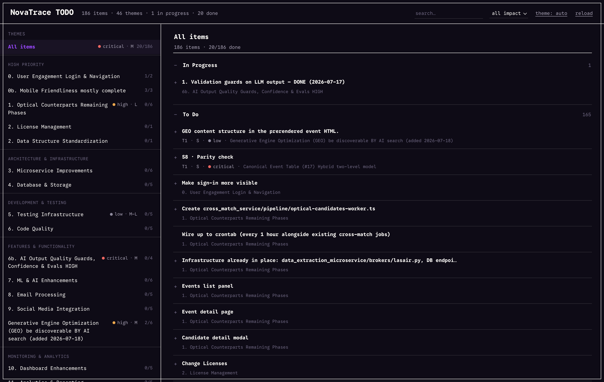
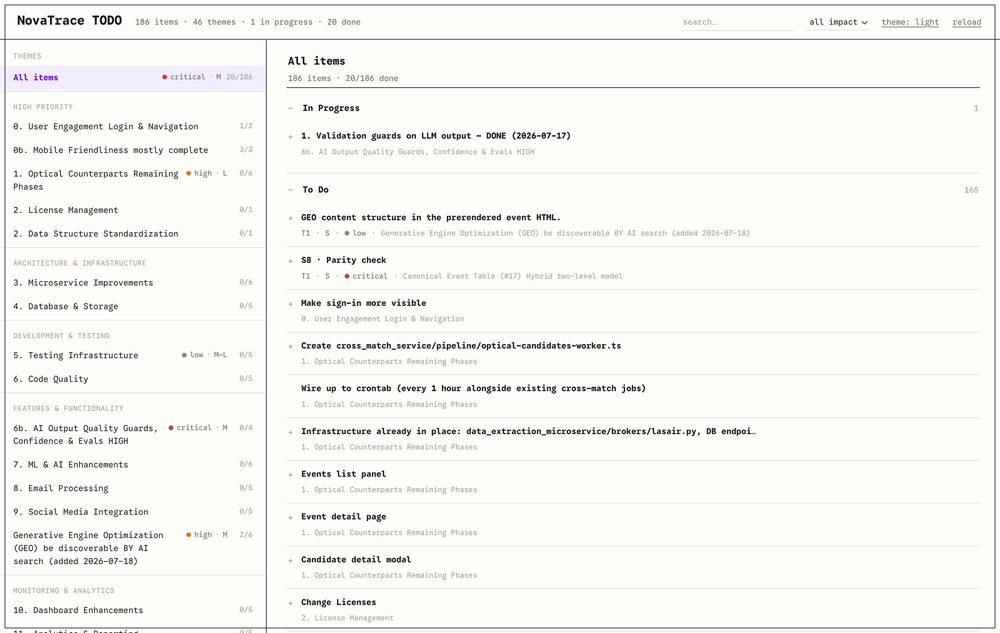

# todo-board

<sub>Built by [Starithm](https://starithm.ai) · MIT licensed</sub>

A zero-dependency, **read-only** board for a Markdown `TODO.md` file. Point it at any
Markdown file and get a clean, minimal EPIC/status board in your browser. Your file stays
the single source of truth — the board never writes to it, so your prose and formatting are
never at risk.



- **No build, no dependencies** — one Node script (built-in `http`/`fs`) + one HTML file.
- **Live** — re-reads the file on every load, so editing the Markdown and refreshing is the
  whole workflow.
- **Structure from Markdown** — headings become groups/themes, task-lists become items,
  grouped into **In Progress / To Do / Done**. See [FORMAT.md](FORMAT.md).
- **Minimal, theme-aware UI** — monospace, light/dark, one CSS-variable block to reskin.

## Quick start

Requires Node 18+.

```bash
# try it with the bundled example
node server.mjs
# → http://localhost:4319

# point it at your own file
node server.mjs /path/to/your/TODO.md
```

Then edit your Markdown file in any editor and hit **reload** in the header (or refresh the
tab). Options:

```bash
PORT=5000 node server.mjs ~/notes/TODO.md     # custom port
TODO_FILE=~/notes/TODO.md node server.mjs      # path via env instead of arg
```

## How it maps your file

- `# Title` → the board title.
- `## Group` → a quiet caption in the left panel.
- `### Theme` → a clickable theme; its items open on the right, split into
  **In Progress / To Do / Done**.
- `- [ ]` / `- [x]` / `- ✅ 🔄 ⬜` → items; sub-bullets fold into each item's detail.
- Optional `🔴 🟠 🟡 ⚪` impact, `S/M/L/XL` effort, and `### Tier N` prioritization tables
  drive the impact/effort badges.

The full contract — including how status (In Progress vs Done) is inferred — is in
[FORMAT.md](FORMAT.md).

## Theming

Light and dark are both first-class — the board follows the system theme by default, and the
`theme` button in the header cycles auto → light → dark. You can also deep-link a theme with
`?theme=light` / `?theme=dark` / `?theme=auto`.



Open `index.html` and edit the CSS variables at the top of the `<style>` block to reskin it.
The accent (`--link`) and the four impact colours (`--crit/--high/--med/--low`) are the main
knobs; light and dark palettes are both defined. The font is
[Google Sans Code](https://fonts.google.com/specimen/Google+Sans+Code) with a system-monospace
fallback when offline.

## Design notes

- **Read-only by design.** A rich, hand-authored TODO carries prose, rationale, and links
  that a board→Markdown re-serializer would flatten. todo-board only ever reads.
- **Heuristic parsing.** It follows the conventions in FORMAT.md; if something is
  miscategorised, it's usually because a marker convention differs. Everything degrades
  gracefully — unknown lines are simply ignored.

## License

MIT — see [LICENSE](LICENSE).
